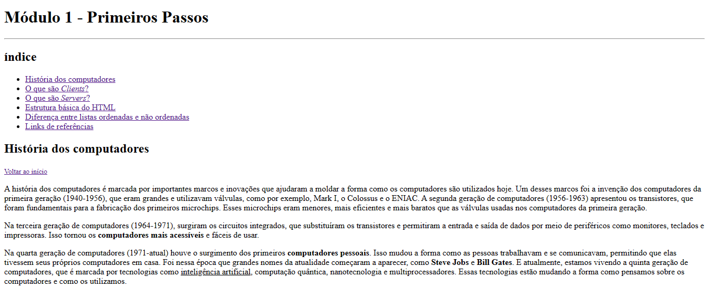

# Página Web

 

O projeto proposto tem como ideia elaborar um website, utilizando a estrutura básica do HTML assim como as tags de texto mostradas em aula.

Algumas das tags mostradas em aula foi:  `<h1>` até `<h6>`, `
`, `<small>`, `<i>`, `<u>`, `<strong>`, `<ol>`, `<ul>`, `<li>`, `<a>`, `
`, `<blockquote>`.

OBS: o conteúdo da página foi produzido com base nas minhas anotações do que aprendi em aula, no módulo 1 do curso.

## Tecnológia
HTML

## Consideração
Fiquei satisfeita em como o curso foi apresentado, utilizando uma linguagem simples que qualquer pessoa poderá entender.
Aprendi a usar tags que fazem com que o usuário navegue de maneira mais rápida e simples pela página, possibilitando com um clique, ele ir até a informação desejada. O que torna mais fácil a vida de qualquer pessoa, não fazendo que ele fique rolando pela página até encontar o que procura.
